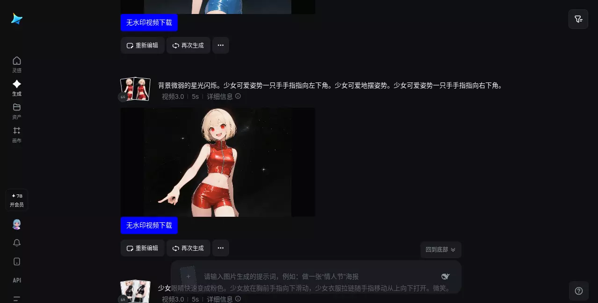
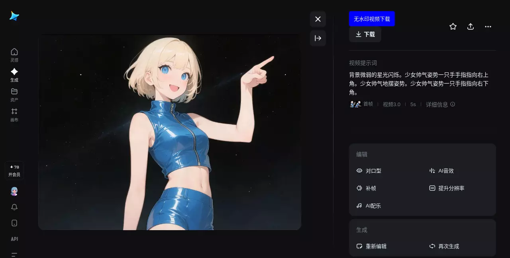
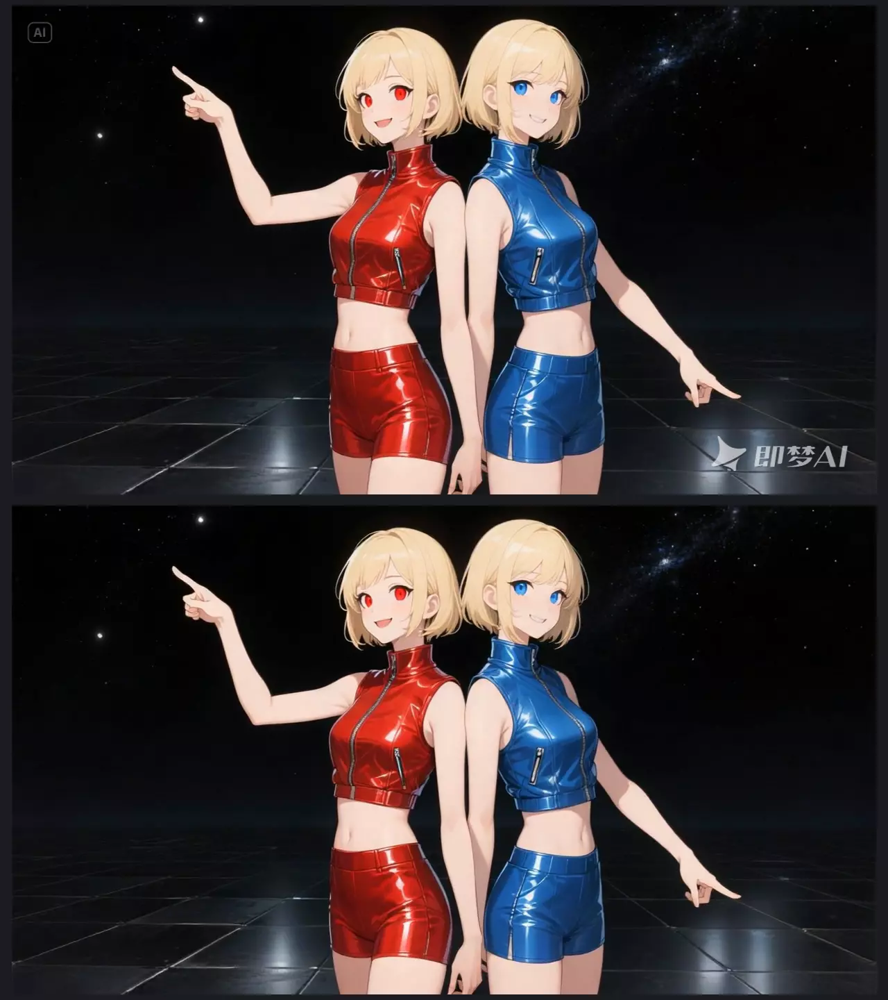

# 从即梦AI下载无水印视频 Download Origin Video from JiMeng without Watermark

这是一个可以让你从 _[即梦AI（jimeng.jianying.com）](https://jimeng.jianying.com)_ 下载无水印视频 的 userscript 。

**重要提示**：此脚本可能会随着 _[即梦AI（jimeng.jianying.com）](https://jimeng.jianying.com)_ 网站的更新而失效。

------

## 使用说明

### 安装

#### ①安装用户脚本管理器

用户需先安装用户脚本管理器，推荐使用 **[篡改猴/油猴（Tampermonkey）](https://www.tampermonkey.net/)**：

- [火狐附加组件](https://addons.mozilla.org/zh-CN/firefox/addon/tampermonkey/)
- [Chrome 应用商店 扩展程序](https://chrome.google.com/webstore/detail/tampermonkey/dhdgffkkebhmkfjojejmpbldmpobfkfo?hl=zh-CN)
- [Microsoft Edge 外接程序](https://microsoftedge.microsoft.com/addons/detail/tampermonkey/iikmkjmpaadaobahmlepeloendndfphd?hl=zh-CN&gl=CN)

或其他同类扩展程序。用户脚本管理器的安装等相关资料均可参见 [Greasy Fork](https://greasyfork.org/)。

#### ②安装本用户脚本

在完成安装用户脚本管理器后，安装本用户脚本。以下提供两种安装渠道：

- Greasyfork脚本安装地址：<https://greasyfork.org/scripts/541644>，点击页面上的 _安装此脚本_ 即可。
- 如果您访问 greasyfork.org 有困难，可以尝试这个 [GitHub链接](https://github.com/catscarlet/Download-from-JiMeng-without-Watermark/raw/refs/heads/main/Download-from-JiMeng-without-Watermark.user.js) 进行安装

### 使用

成功安装后，在生成页面的视频内容下会新增一个 **「无水印视频下载」** 按钮。在视频详情页的右上角操作区也会新增一个 **「无水印视频下载」** 按钮。点击后会下载文件名为 _提示词_ 的无水印视频文件。如果提示词为空，则文件名将变为 _无提示词+当前页面的时间戳_ 。

### 兼容性

脚本可正确在以下用户脚本管理器中运行

- Tampermonkey: 5.3.3

脚本可正确在以下浏览器中运行。

- Firefox: 140.0.2

------

## 截图

### 效果图

16:9

9:16

------

## 源码

Github： <https://github.com/catscarlet/Download-Origin-Image-from-Doubao-without-Watermark>

------

## LICENSE

This project is licensed under **GNU AFFERO GENERAL PUBLIC LICENSE Version 3**
